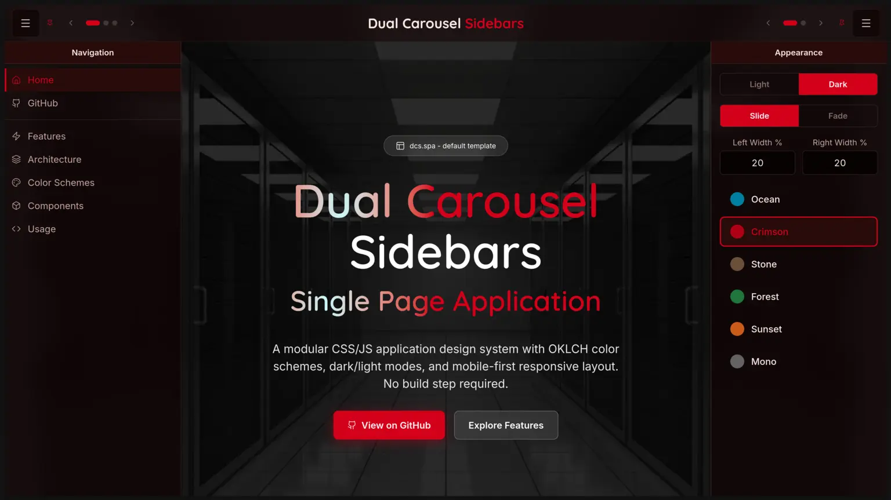

<div align="center">


**A modular CSS/JS design system: dual off-canvas sidebars with a carousel of panels inside each, OKLCH color schemes, dark/light modes, mobile-first responsive layout, and marketing components. Zero dependencies, no build step.**

[](https://opensource.org/licenses/MIT)
[](#)
[](#)
[](#)
[](https://github.com/markc/dcs.spa/releases)

**✨ 100% proudly vibe coded by the one and only Claude Code ✨**



**[laradcs](https://github.com/markc/laradcs)** — The Dual Carousel Sidebars starter kit for Laravel + Inertia + React.

**Live demo:** [dcs.spa](https://dcs.spa)

</div>

---

## Quick Start

```bash
git clone https://github.com/markc/dcs.spa.git
cd dcs.spa
php -S localhost:8000 -t docs     # or: npx serve docs
```

Open `http://localhost:8000` — same page deployed to [dcs.spa](https://dcs.spa).

## Files

| File | Purpose |
|------|---------|
| `base.css` | Generic framework (layout, components, utilities, animations) |
| `base.js` | App shell (theme, schemes, sidebars, panel carousel, tree, toast) |
| `site.css` | Marketing theme (OKLCH colors, hero, cards, pricing, particles) |
| `site.js` | Marketing enhancements (particles, scroll reveal, year) |
| `md.js` | Markdown renderer (documentation sites) |

Real files live in `docs/` (the GitHub Pages source). Root symlinks make them convenient to reference from sibling projects.

## Architecture

```
base.css  ← Generic, color-agnostic, NEVER modify per-site
base.js   ← Generic, NEVER modify per-site
site.css  ← YOUR colors + marketing components (customize this)
site.js   ← YOUR JavaScript enhancements (optional)
```

`base.css` uses CSS cascade layers (`reset`, `tokens`, `base`, `components`, `utilities`, `animations`) and defines zero colors. All colors come from CSS custom properties defined in `site.css`.

## Color Schemes

Six OKLCH schemes, each with light + dark variants. For the five colored schemes, only the hue changes; lightness/chroma ratios stay consistent. Mono sets chroma to 0 for pure grayscale (status colors stay colored so success/danger/warning remain legible).

| Scheme | Hue | Character |
|--------|-----|-----------|
| **Ocean** | 220 | Cyan-blue, professional (default) |
| **Crimson** | 25 | Bold red, high energy |
| **Stone** | 60 | Warm neutral, minimal |
| **Forest** | 150 | Natural green, calming |
| **Sunset** | 45 | Warm amber |
| **Mono** | — | Black, gray, white (C=0) |

Switch live via the Appearance panel (right sidebar) or programmatically:

```javascript
Base.setScheme('forest');   // ocean, crimson, stone, forest, sunset, mono
Base.toggleTheme();         // dark ↔ light
```

## Usage

### 1. Marketing / Brochure Site

```html
<link rel="stylesheet" href="base.css">
<link rel="stylesheet" href="site.css">
<script src="base.js"></script>
<script src="site.js"></script>
```

Copy all four files plus a hero background image. Edit `site.css` to change the default hue.

### 2. Documentation Site

```html
<link rel="stylesheet" href="base.css">
<link rel="stylesheet" href="site.css">
<script src="base.js"></script>
<script src="md.js"></script>
```

Same two stylesheets as a marketing site &mdash; if your HTML never uses the marketing components (hero, service cards, pricing, CTAs), those rules simply do not render. `md.js` exposes `md()` (string &rarr; HTML) and `loadDoc()` (fetch + render); add `data-md-auto` to a container to opt in to automatic loading. Pick a scheme via `Base.setScheme('stone')` or the Appearance panel.

### 3. Laravel + React (Inertia v2)

Import the OKLCH color tokens into your Tailwind v4 `@theme` block and use React context for theme state instead of `base.js`. Color math stays identical.

## Components

### App Shell
- Fixed glass topnav, dual off-canvas sidebars (left + right)
- **Autonomous sidebars** — each side toggles independently; opening one does not close the other
- Pinnable on desktop (1280px+); pinned sidebars reserve space from main content
- **Panel carousel** inside each sidebar — slide or fade transitions, dots + chevron nav
- **Appearance panel** (built in) — theme toggle, carousel-mode toggle, sidebar width sliders, scheme dots
- **Tree widget** — hierarchical nav (file browsers, doc TOCs) with collapsible branches and persisted expand state
- **Independent sidebar widths** — `--sidebar-width-left` / `--sidebar-width-right`, 25–75% via sliders, clamped for small viewports

### Cards
- Mobile: edge-to-edge (no radius, no side borders)
- Desktop: rounded, shadowed, optional hover lift
- Size variants: `.card-sm`, `.card-md`, `.card-lg`

### Buttons
- `.btn` (filled), `.btn-outline`, `.btn-ghost`
- `.btn-success`, `.btn-danger`, `.btn-warning`
- `.btn-sm`, `.btn-lg`

### Marketing (site.css)
- Hero section (100vh with background image)
- Service cards with glass morphism
- Pricing tables
- CTA buttons (`.cta-btn.primary`, `.cta-btn.secondary`)
- Floating particles, scroll reveal animations

### Content
- `.prose` for markdown/article rendering
- Forms with focus rings
- Dropdowns
- Toast notifications
- Data tables

## CSS Variable Contract

`site.css` must define these tokens (the base framework reads them, defining none of its own):

```css
--bg-primary, --bg-secondary, --bg-tertiary
--fg-primary, --fg-secondary, --fg-muted
--accent, --accent-hover, --accent-fg, --accent-subtle
--border, --border-muted
--success, --danger, --warning
--glass, --glass-border
```

## Further Reading

In-tree docs (served alongside the showcase):

- [`docs/_doc/architecture.md`](docs/_doc/architecture.md)
- [`docs/_doc/color-system.md`](docs/_doc/color-system.md)
- [`docs/_doc/components.md`](docs/_doc/components.md)
- [`docs/_doc/usage-patterns.md`](docs/_doc/usage-patterns.md)

## Built With DCS

- [dcs.spa](https://dcs.spa) — Self-documenting showcase
- [motd.com](https://motd.com) — AI via email
- [renta.net](https://renta.net) — Managed Linux hosting
- [SPE](https://github.com/markc/spe) — PHP 8.5 tutorial documentation

## License

MIT License — Copyright © 2026 Mark Constable &lt;mc@dcs.spa&gt;
